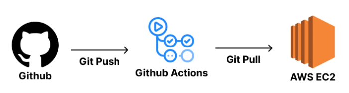

# CI/CD

## EC2

<details>
   <summary> 정리 (📖 Click)</summary>
<br />

* EC2(Elastic Compute Cloud)
  * 컴퓨터를 빌려 원격으로 접속해 사용하는 서비스

-----------------------
</details>

## 리전(Region)

<details>
   <summary> 정리 (📖 Click)</summary>
<br />

* 인프라를 지리적으로 나누어 배포한 각각의 데이터 센터
  * 애플리케이션의 주된 사용자들의 위치와 지리적으로 가까운 리전을 선택하는 것이 유리하다.

-----------------------
</details>

## EC2 세팅 방법 정리

<details>
   <summary> 정리 (📖 Click)</summary>
<br />

* 추천 OS : ubuntu
* 인스턴스 : 인스턴스란, EC2에서 빌린 컴퓨터 한 대
* 키 페어 : EC2 인스턴스에 접속하기 위한 비밀번호(관리 필수)
* 네트워크 설정
  * 보안 그룹 : AWS 클라우드에서의 네트워크 보안
  * 인바운드 트래픽 : 외부에서 EC2 인스턴스로 보내는 트래픽
  * 아웃바운드 트래픽 : EC2 인스턴스에서 외부로 나가는 트래픽

#### 보안그룹 설정

* 방화벽(보안 그룹)
  * 설정 보안 그룸 설명 : 내가 배포할 백엔드 서버는 HTTP(80번)를 개방하겠다. 


-----------------------
</details>

## IP와 Port의 개념

<details>
   <summary> 정리 (📖 Click)</summary>
<br />

* IP : 네트워크 상에서의 특정 컴퓨터를 가리키는 주소
* Port : 한 컴퓨터 내에서 실행되고 있는 특정 프로그램의 주소
* 브라우저 창에 포트 번호를 입력하지 않는 이유
  * 주소 창에 도메인 주소를 입력해서 엔터를 누르면 브라우저는 기본적으로 80번 포트로 통신을 보내기 때문이다.

* 잘 알려진 포트(well-known port)란?
  * 0 ~ 1023번까지 포트 번호
  * 규약을 통해 역할이 정해져 있는 포트 번호
  * 정해놓은 규약을 꼭 지키지 않아도 무방하나 가급적이면 지키는 것을 권장한다. 

-----------------------
</details>

## EBS(Elastic Block Store)

<details>
   <summary> 정리 (📖 Click)</summary>
<br />

* EC2 안에 부착되어 있는 일종의 하드디스크
* 스토리지(storage), 볼륨(volume)이라고도 표현

-----------------------
</details>

## [실습 내용 정리] SpringBoot 서버를 EC2 인스턴스에 배포하기

<details>
   <summary> 정리 (📖 Click)</summary>
<br />

1. 스프링 부트를 실행시키기 위한 JDK를 설치하기

```text
sudo apt update && sudo apt install openjdk-17-jdk -y
```

2. EC2 인스턴스에서 클론하기

```text
git clone ~
```

3. application.yml 파일 직접 만들기

* application.yml과 같은 민감한 정보가 포함된 파일은 git으로 버전 관리를 하지 않는 것이 일반적이다.
* 따라서 application.yml 파일은 별도로 EC2 인스턴스에 올려주어야 한다.
* 하지만 application.yml 파일을 EC2 인스턴스에 올리는 작업보다는 application.yml 파일을 직접 만드는 게 훨씬 간단하다.

4. 서버 실행하기

```text
./gradlew clean build   
cd [프로젝트명]/build/libs
sudo java -jar [빌드된 JAR 파일명]
```

5. EC2 인스턴스의 탄력적 IP를 통해 배포한 SpringBoot 서버에 진입하기


-----------------------
</details>

## CI/CD(Continuous Integration / Continuous Deployment)

<details>
   <summary> 정리 (📖 Click)</summary>
<br />

* CI/CD(Continuous Integration / Continuous Deployment)
  * 테스트(Test), 통합(Merge), 배포(Deploy)의 과정을 자동화하는 것


* CI/CD를 구축할 때 사용하는 툴
  * Github Actions
  * Jenkins
  * Circle CI
  * Travis CI

* 현업에서 잘 사용되는 툴 : Github Actions, Jenkins
  * Github Actions는 별도 서버 구축 없이 Github에 내장되어 있는 Github Actions 기능을 사용할 수 있다.
  * 비용적인 측면도 유리하고 셋팅하는 데 시간을 쓸 필요도 없다.
  * https://tech.kakao.com/posts/516 : 카카오엔터프라이즈가 Github Actions를 사용하는 이유
  
* CI/CD 전체적인 흐름


1. 코드 작성 후 커밋
2. Github에 푸시
3. Push를 감지해서 Github Actions에 작성한 로직이 실행

   a. 빌드(Build)
   b. 테스트(Test)
   c. 배포(Deploy)
4. 서버에서 배포된 최신 코드로 서버 재실행

-----------------------
</details>

## [실습 내용 정리] 개인 프로젝트에서 많이 쓰는 CI/CD 구축 방법

<details>
   <summary> 정리 (📖 Click)</summary>
<br />



* 전체 CI/CD 흐름 분석하기
  * EC2에 접속하여 `git pull`을 활용해서 변경된 부분의 프로젝트 코드에 대해서만 업데이트 하기 때문에 CI/CD 속도가 빠르다.
  * CI/CD 툴로 Github Actions를 사용하기 때문에 인프라 구조가 복잡하지 않고 간단하다.
  * 빌드 작업을 EC2에서 진행하기 때문에 운영하고 있는 서버 성능에 영향을 미칠 수 있다.
  * Github 계정 정보가 해당 EC2에 저장되기 때문에 개인 프로젝트 또는 믿을만한 사람들과 같이 진행하는 토이 프로젝트의 경우에만 사용 가능하다.

1. AWS EC2 인스턴스 생성하기


* 보안 그룹 설명
  * SSH : 22번
  * HTTP : 80번(기본 포트)
  * TCP : 8080번(Spring-Boot 포트)

2. 리포지토리 클론하기

```text
git clone ~
```

▶ 빌드 과정에서 권한 오류가 발생한 경우 아래 명령어를 입력하여 실행 권한을 부여하면 된다.

```text
chmod +x ./gradlew
```

3. 빌드된 JAR 파일 실행하기

```text
sudo java -jar CICDTest-0.0.1-SNAPSHOT.jar
```

4. 결과 확인


5. 코드의 변경 사항을 매번 EC2에서 작업하기 번거로우므로 Github Actions 관련 파일을 작성하여 이를 자동화하기

```yaml
name: 개인 프로젝트에서 많이 쓰는 CI/CD 구축 방법 - 1

on:
  push:
    branches:
      - main

# Ref. https://github.com/appleboy/ssh-action
jobs:
  deploy:
    runs-on: ubuntu-latest
    steps:
      - name: SSH로 EC2에 접속하기
        uses: appleboy/ssh-action@v1.0.3  # 어떤 라이브러리를 사용할 것인지 기재하는 부분
        with:
          host: ${{ secrets.EC2_HOST }}
          username: ${{ secrets.EC2_USERNAME }}
          key: ${{ secrets.EC2_PRIVATE_KEY }}
          script_stop: true
          script: |
            cd /home/ubuntu/CI-CD-Test
            git pull origin main
            chmod +x ./gradlew
            ./gradlew clean build
            sudo fuser -k -n tcp 8080 || true
            nohup java -jar build/libs/*SNAPSHOT.jar > ./output.log 2>&1 &
```

6. 리포지토리 [settings]에서 `secrets` 설정

* EC2_HOST : Public IP(탄력적 IP 주소)
* EC2_USERNAME : EC2 인스턴스 생성 시 입력한 사용자 이름
* EC2_PRIVATE_KEY : EC2 인스턴스 생성 시 같이 만들었던 키 페어


7. 버전 관리를 하지 않는 `application.yml` 혹은 `application.properties` 파일에 대한 관리

```yaml
name: 개인 프로젝트에서 많이 쓰는 CI/CD 구축 방법 - 1

on:
  push:
    branches:
      - main

jobs:
  deploy:
    runs-on: ubuntu-latest

    # Ref. https://github.com/appleboy/ssh-action
    steps:
      - name: SSH로 EC2에 접속하기
        uses: appleboy/ssh-action@v1.0.3                                      # 어떤 라이브러리를 사용할 것인지 기재하는 부분
        env:
          APPLICATION_PROPERTIES: ${{ secrets.APPLICATION_PROPERTIES }}       # application.yml 파일 역시 secrets으로 등록
        with:
          host: ${{ secrets.EC2_HOST }}                                       # Public IP
          username: ${{ secrets.EC2_USERNAME }}                               # EC2 인스턴스 생성 시 입력한 사용자 이름
          key: ${{ secrets.EC2_PRIVATE_KEY }}                                 # EC2 인스턴스 생성 시 입력한 키 페어
          envs: ${{ secrets.APPLICATION_PROPERTIES }}                         # 위에서 등록한 어플리케이션 환경변수 등록
          script_stop: true

          # 순서 정리

          # 1. 경로 이동
          # 2. 기존에 application.yml 파일이 존재하는 경우 지우기
          # 3. git pull로 최신 소스 코드를 가져오기
          # 4. secrets에 등록한 환경변수를 application.yml 파일에 넣기(리눅스 입출력 >)
          # 5. 실행 권한 부여
          # 6. 빌드 작업 수행
          # 7. 포트 충돌을 방지하기 위해 8080번 포트를 사용하지 못하도록 하기
          # 8. 백그라운드로 애플리케이션을 실행
          script: |
            cd /home/ubuntu/CI-CD-Test
            rm -rf src/main/resources/application.yml                         
            git pull origin main
            echo "$APPLICATION_PROPERTIES" > src/main/resources/application.yml
            chmod +x ./gradlew
            ./gradlew clean build
            sudo fuser -k -n tcp 8080 || true
            nohup java -jar build/libs/*SNAPSHOT.jar > ./output.log 2>&1 &
```

#### ※ 발생했던 오류


* secrets 변수 정의 오류에서 비롯됨

-----------------------
</details>

## [실습 내용 정리] 일반 프로젝트에서 많이 쓰는 CI/CD 구축 방법

<details>
   <summary> 정리 (📖 Click)</summary>
<br />


* 전체 CI/CD 흐름 분석하기
  * 빌드 작업을 Github Actions에서 하기 때문에 운영 서버의 성능에 영향을 미치지 않는다.
  * CI/CD 툴로 Github Actions만 사용하기 때문에 인프라 구조가 복잡하지 않고 간단하다.
  * 무중단 배포를 구현하거나 여러 EC2 인스턴스에 배포를 해야 하는 상황이라면, 직접 Github Actions 스크립트를 작성해서 구현해야 한다.

```yaml
name: 일반 프로젝트에서 많이 쓰는 CI/CD 구축 방법

on:
  push:
    branches:
      - main

jobs:
  deploy:
    runs-on: ubuntu-latest

    # Ref. https://github.com/appleboy/ssh-action
    steps:
      - name: Github Repository에 올린 파일들을 불러오기
        uses: actions/checkout@v4

      - name: JDK 17 version 설치하기
        uses: actions/setup-java@v4
        with:
          distribution: temurin
          java-version: 17

      - name: 버전 관리를 하지 않는 application.yml 파일 작성하기
        run: echo "${{ secrets.APPLICATION_PROPERTIES }}" > ./src/main/resources/application.yml

      - name: 권한 부여
        run: chmod +x ./gradlew

      - name: 테스트 및 빌드하기
        run: ./gradlew clean build

      - name: 빌드된 파일의 이름을 다루기 편하게 변경하기
        run: mv ./build/libs/*SNAPSHOT.jar ./project.jar

      - name: SCP로 EC2에 빌드된 파일을 전송하기
        uses: appleboy/scp-action@v0.1.7
        with:
          host: ${{ secrets.EC2_HOST }}
          username: ${{ secrets.EC2_USERNAME }}
          key: ${{ secrets.EC2_PRIVATE_KEY }}
          source: project.jar
          target: /home/ubuntu/CI-CD-Test/result

      - name: SSH로 EC2에 접속하기
        uses: appleboy/ssh-action@v1.0.3                                      # 어떤 라이브러리를 사용할 것인지 기재하는 부분
        with:
          host: ${{ secrets.EC2_HOST }}                                       # Public IP
          username: ${{ secrets.EC2_USERNAME }}                               # EC2 인스턴스 생성 시 입력한 사용자 이름
          key: ${{ secrets.EC2_PRIVATE_KEY }}                                 # EC2 인스턴스 생성 시 입력한 키 페어
          script_stop: true

          # 순서 정리

          # 1. current 폴더 : 현재 실행 중인 프로그램만 모아 놓은 것
          # 2. 있다면 해당 폴더를 지우고 새로 만들기
          # 3. 최신 소스코드를 target에 SCP로 전송한 후 마지막에 지워주기
          script: |
            rm -rf /home/ubuntu/CI-CD-Test/current
            mkdir /home/ubuntu/CI-CD-Test/current
            mv /home/ubuntu/CI-CD-Test/result/project.jar /home/ubuntu/CI-CD-Test/current/project.jar
            cd /home/ubuntu/CI-CD-Test/current
            sudo fuser -k -n tcp 8080 || true
            nohup java -jar project.jar > ./output.log 2>&1 &
            rm -rf /home/ubuntu/CI-CD-Test/result
```

-----------------------
</details>

## [실습 내용 정리] 확장성을 고려한 프로젝트에서 많이 쓰는 CI/CD 구축 방법

<details>
   <summary> 정리 (📖 Click)</summary>
<br />


* CodeDeploy를 사용하는 이유
  * CodeDeploy는 수많은 AWS EC2에 배포를 쉽게 할 수 있도록 도와준다.
  * CodeDeploy에 무중단 배포 기능이 내재되어 있어 손쉽게 무중단 배포를 진행할 수 있다.
  * 서버가 여러 대이더라도 자동 배포를 쉽게 구축할 수 있다.
  * 쉽게 무중단 배포를 적용시킬 수 있다.
  * CodeDeploy를 사용함으로써 인프라 구조가 이전 실습에 비해 복잡해졌다. 구조가 복잡해짐에 따라 관리 비용, 유지보수 비용, 난이도, 트러블 슈팅 어려움, 복잡도가 증가한다.
  * 서버를 여러 대 이상 구동해야 하거나 무중단 배포가 중요한 서비스일 때 주로 활용한다.
  * 복잡한 인프라가 실력을 보장하진 않는다. 간단한 프로젝트에서 이런 복잡한 인프라를 가져가면 오버 엔지니어링 평가를 듣게 될 것이다.

-----------------------
</details>