# Docker

## Docker를 사용하는 이유

* 장점 : 특정 프로그램을 다른 곳으로 쉽게 옮겨서 설치 및 실행할 수 있다.

## Docker란?

* 컨테이너를 사용하여 각각의 프로그램을 분리된 환경에서 실행 및 관리할 수 있는 툴이다.

## 컨테이너란?

* 하나의 컴퓨터 환경 내에서 독립적인 컴퓨터 환경을 구성해 각 환경에 프로그램을 별도로 설치할 수 있게 만든 개념
* 하나의 컴퓨터 환경 내에서 여러 개의 미니 컴퓨터 환경을 구성 → 미니 컴퓨터(컨테이너)

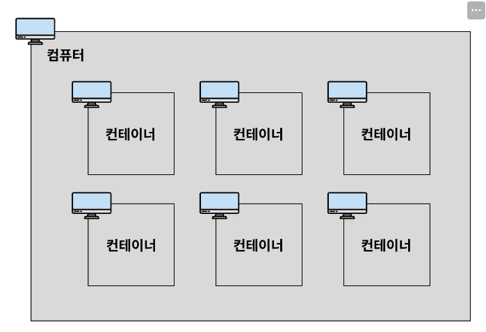

* 컨테이너와 컨테이너를 포함하는 컴퓨터를 구분하기 위해 컨테이너를 포함하고 있는 컴퓨터를 호스트 컴퓨터라고 한다.

## 컨테이너의 독립성

* 컨테이너는 독립적인 컴퓨터 환경이라고 얘기했는데 구체적으로 어떤 것들이 독립적으로 관리가 되는지에 대해서 정리
  * 디스크(저장 공간) : 각 컨테이너마다 서로 각자의 저장 공간을 가지고 있다.
  * 일반적으로 A 컨테이너 내부에서 B 컨테이너 내부에 있는 파일에 직접 접근할 수 없다.

* 네트워크(IP, Port) : 각 컨테이너마다 고유한 네트워크 주소를 가진다.
  * 컨테이너는 각자의 IP 주소를 가지고 있다.

## 이미지(image)란?

* 이미지는 프로그램을 실행하는 데 필요한 설치 과정, 설정, 버전 정보 등을 포함하고 있다.
* 즉, 프로그램을 실행하는 데 필요한 모든 것을 포함하고 있다.

---

# Docker 컨테이너에 Nginx 설치 및 실행해보기

## Docker 설치

* [Windows Docker 설치 메뉴얼](https://myanjini.tistory.com/entry/%EC%9C%88%EB%8F%84%EC%9A%B0%EC%97%90-%EB%8F%84%EC%BB%A4-%EB%8D%B0%EC%8A%A4%ED%81%AC%ED%83%91-%EC%84%A4%EC%B9%98)

## Docker 이미지 다운로드 및 이미지 확인하기

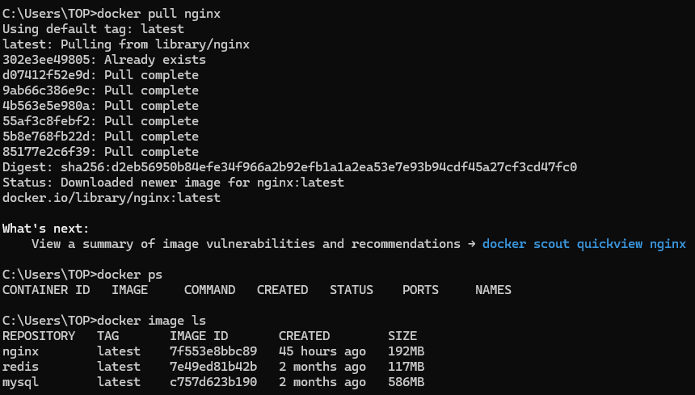

## 이미지를 컨테이너에 올려 Nginx 서버 실행시키고 결과 확인하기

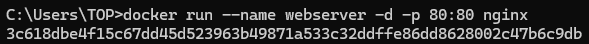

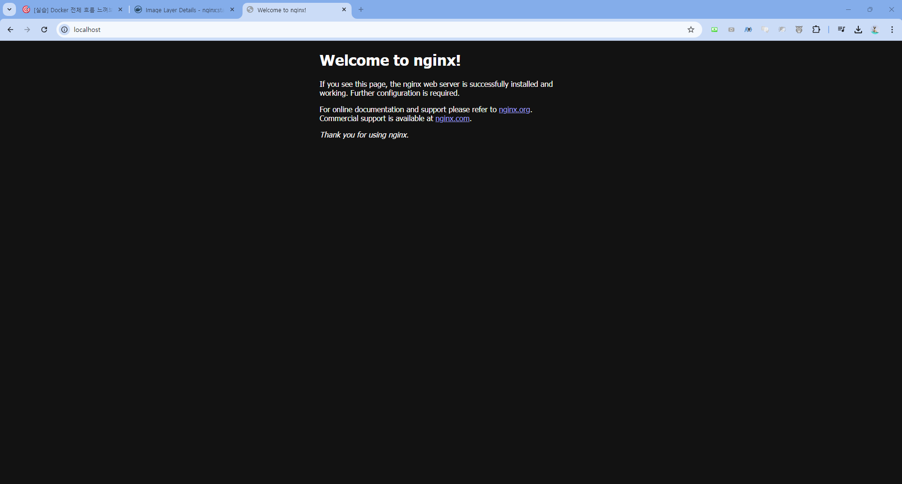

## 도커 컨테이너 닫기

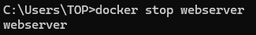

## 머릿속으로 그려보는 상황

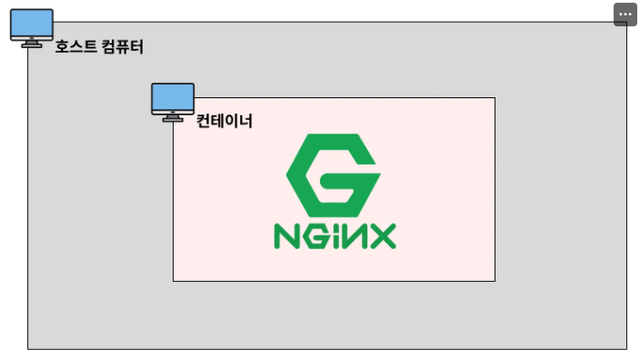

---

# 현업에서 자주 사용하는 Docker CLI

[Docker Hub](https://hub.docker.com/)

* 이미지 다운로드하기 → 기본적으로 최신 이미지

```text
docker pull [이미지 이름]

# ex. docker pull mysql
```

* 특정 버전의 이미지 다운로드하기 → 태그명이 필수

```text
docker pull [이미지 이름]:[태그명]

# ex. docker pull mysql:8.0.39-bookworm
```

* 이미지 조회

```text
docker image ls
```

* 특정 이미지 삭제

```text
docker image rm [이미지 ID 또는 이미지명]
```

* 중지된 컨테이너에서 사용하고 있는 이미지 강제 삭제하기

```text
docker image rm -f [이미지 ID 또는 이미지명]
```

* 컨테이너 생성
  * 이 때, 컨테이너를 실행시키지는 않는다.

```text
docker create [이미지명]
```

* 모든 컨테이너 조회

```text
docker ps -a
```

* 정지된 컨테이너 실행

```text
docker start [컨테이너명 또는 컨테이너 ID]
```

* 컨테이너 생성 및 실행
  * 포그라운드(foreground)와 백그라운드(background)
    * 포그라운드(foreground)는 내가 실행시킨 프로그램 내용이 화면에서 실행되고 출력되는 상태를 뜻한다.
    * 그러다보니 포그라운드 상태에서는 다른 프로그램을 조작할 수 없다.
    * 백그라운드(background)는 내가 실행시킨 프로그램이 컴퓨터 내부적으로 실행되는 상태를 의미한다.
    * 그래서 프로그램이 어떻게 실행되고 있는지에 대한 정보를 화면에서 확인할 수 없다.
    * 이런 특성 때문에 다른 명령어를 추가로 입력할 수도 있고, 새로운 프로그램을 조작할 수도 있다.

```text
docker run [이미지명] # 포그라운드

docker run -d [이미지명] # 백그라운드
```

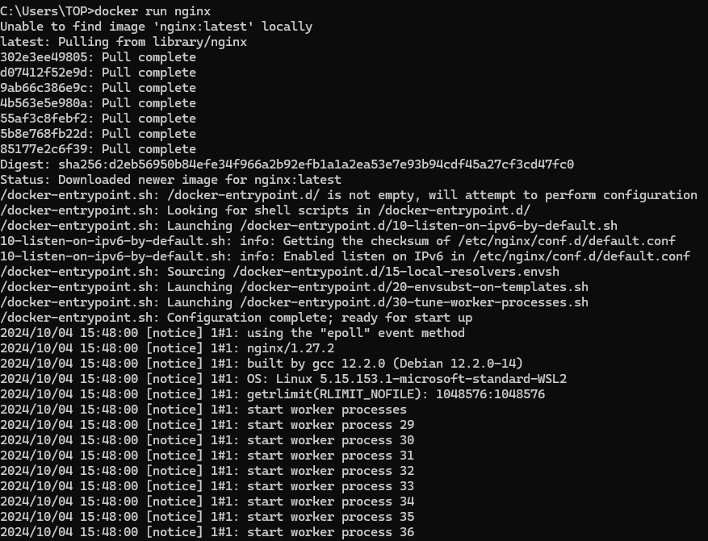

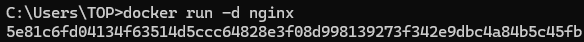

* 컨테이너에 커스텀으로 이름을 붙여서 생성 및 실행

```text
docker run -d --name [컨테이너 이름] [이미지 명]
```

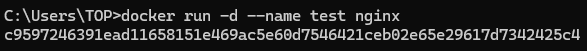

* 호스트 컴퓨터 포트와 컨테이너 포트를 연결

```text
docker run -d -p [호스트 포트 번호]:[컨테이너 포트 번호] [이미지명]

# docker run -d -p 4000:80 nginx
```

* 호스트 컴퓨터 내부에 컨테이너를 띄우고 Nginx 서버를 실행시켰다.
* 하지만 클라이언트 입장에서 80번 포트로 직접 접근할 수 없다.
* 왜냐하면 Nginx의 포트는 호스트 컴퓨터만 아는 것이지 클라이언트 측에서는 알 수 없기 때문이다.
* 따라서 호스트 포트와 컨테이너 포트를 연결시켜주어야 한다.
* 위에서 예를 들어 작성한 CLI는 호스트 컴퓨터 4000번 포트를 컨테이너 80번 포트와 연결을 시켜준다는 뜻이다.
* 그렇다면 이와 같은 방법말고 클라이언트 측과 컨테이너를 직접적으로 연결하려면 어떻게 해야될까?
* 클라이언트 측의 접속은 HTTP로 기본적으로 80번 포트를 사용한다. 따라서 80번 포트와 직접적으로 연결을 맺어주게 되면 실행되는 것을 확인할 수 있을 것이다.

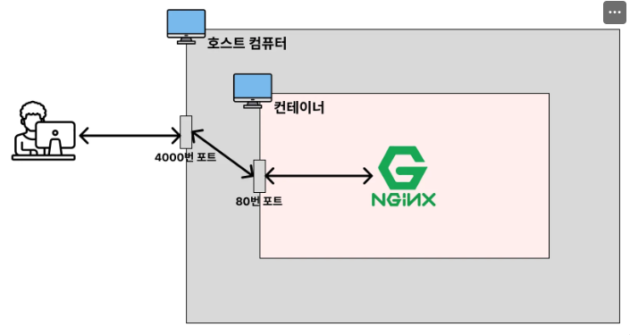

* 컨테이너 조회

```text
docker ps
docker ps -a
```

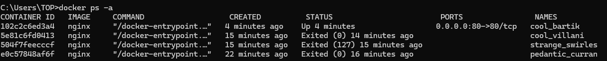

* 컨테이너 중지

```text
docker stop [컨테이너명 또는 컨테이너 ID]
docker kill [컨테이너명 또는 컨테이너 ID]
```

* 컨테이너 삭제

```text
docker rm [컨테이너명 또는 컨테이너 ID]
```

* 실행되고 있는 컨테이터 강제 삭제

```text
docker rm -f [컨테이너명 또는 컨테이너 ID]
```

* 컨테이너 로그 조회

```text
docker logs [컨테이너 ID]
```

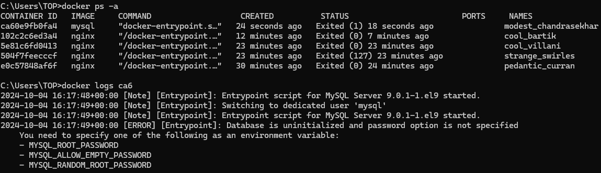

* 실행중인 컨테이너 내부에 접속
  * bash : 배시셸
  * `-it`: 계속해서 명령어를 입력할 수 있도록 해주는 옵션
  * `exit` : 해당 명령어로 컨테이너 내부에서 나올 수 있다.

```text
docker exec -it [컨테이너명 또는 컨테이너 ID] bash
```

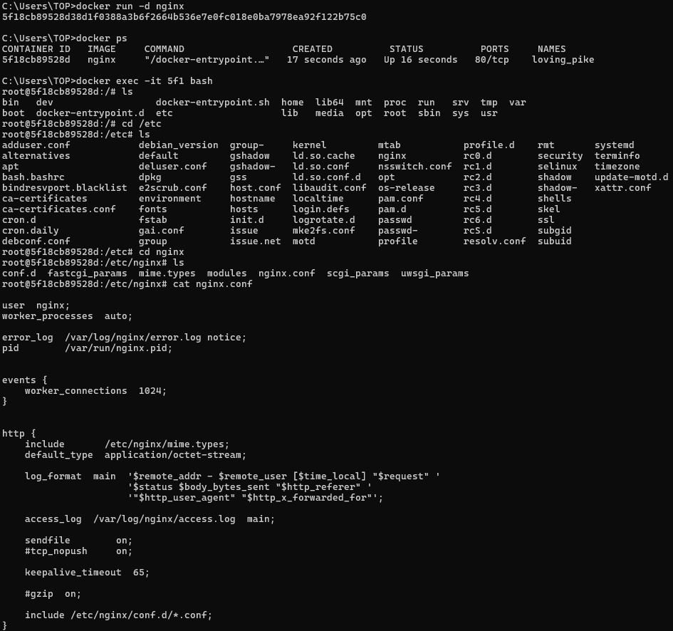

---

# Docker Volume(도커 볼륨)

* 컨테이너가 가지는 문제점
  * Docker를 활용하면 특정 프로그램을 컨테이너에 쉽게 띄울 수 있다.
  * 이 프로그램에 기능이 추가되면 새로운 이미지를 만들어서 컨테이너에 실행시켜야 한다.
  * 이 때, Docker는 기존 컨테이너에서 변경된 부분을 수정하지 않고, 새로운 컨테이너를 만들어서 통째로 갈아끼우는 방식으로 교체를 한다.
  * 이런 특징 때문에 기존 컨테이너를 새로운 컨테이너로 교체하게 된다면 기존 컨테이너 내부에 있던 데이터들 역시 같이 삭제가 되어버린다.
  * 만약 이 컨테이너가 MySQL을 실행시키는 컨테이너였다면 MySQL에 저장된 데이터도 같이 삭제되어버린다.
  * 따라서 컨테이너 내부에 저장된 데이터가 삭제되면 안 되는 경우에는 볼륨(Volume)이라는 개념을 활용해야 한다.


* Docker Volume(도커 볼륨)
  * 도커 컨테이너에서 데이터를 영속적으로 저장하기 위한 방법이다.
  * 볼륨은 컨테이너 자체 저장 공간을 사용하지 않고 호스트 자체의 저장 공간을 공유해서 사용하는 방법이다.

```text
docker run -v [호스트 디렉터리 절대 경로]:[컨테이너 디렉터리 절대 경로] [이미지명]:[태그명]
```

1. 호스트 디렉터리 절대 경로에 이미 디렉터리가 존재한다면 호스트 디렉터리가 컨테이터 디렉터리를 덮어 씌운다.

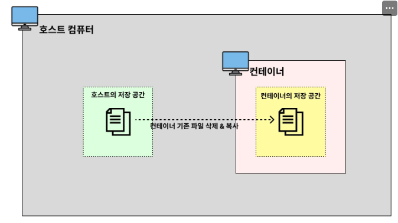

2. 호스트 디렉터리 절대 경로에 디렉터리가 존재하지 않는다면 호스트 디렉터리 절대 경로에 디렉터리를 새로 만들고 컨테이너 디렉터리에 있는 파일들을 호스트 디렉터리로 복사한다.

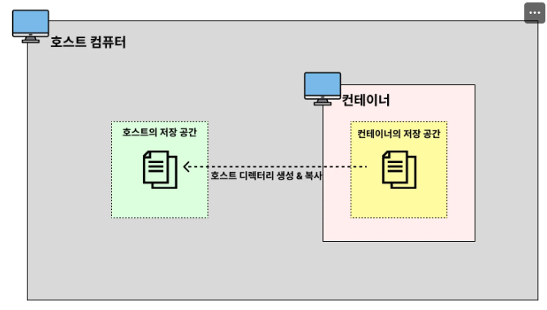

---

# [추가 실습] Docker로 MySQL 실행

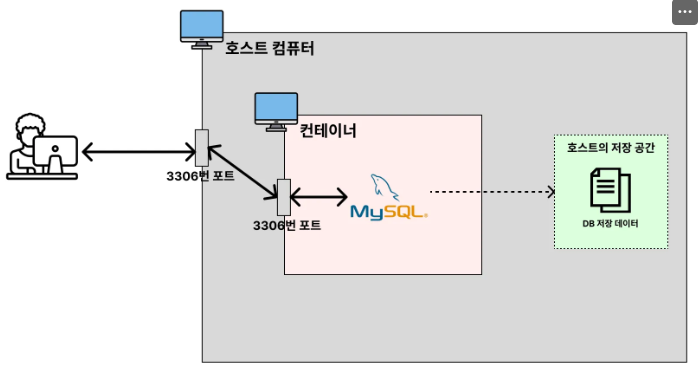

* MySQL 데이터를 저장하기 위한 별도의 폴더를 생성 : `C:\Users\TOP\DB-data\docker-mysql`
* 상대 경로이므로 절대 경로로 변경 → `/c/Users/TOP/DB-data/docker-mysql`
* 실제로 MySQL DB에 관련된 데이터가 저장되는 곳은 `/var/lib/mysql`이다.
* 이 때, 주의할 점은 컨테이너의 패스워드이다.
  * 예를 들어, MySQL의 데이터를 저장할 컨테이너 내부에서 데이터베이스를 생성할 때, 패스워드를 123으로 했다고 가정하자.
  * 그렇게 되면 이미 Docker Volume으로 설정해둔 폴더에 이미 비밀번호가 저장이 된다.
  * 그래서 기존 MySQL 컨테이너를 삭제한 후 다시 MySQL 컨테이너를 생성할 때, 패스워드를 기존 패스워드와 달리 하게 되면 접속이 되지 않게 된다.
  * **따라서 기존 MySQL 컨테이너와 새로 만든 MySQL 컨테이너의 패스워드는 같도록 만들어야 한다.**

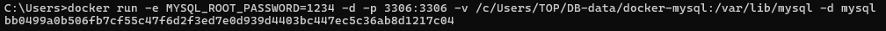

```text
// 내가 만든 폴더의 상대 경로(MySQL의 데이터를 저장할 위치)
C:\Users\TOP\DB-data\docker-mysql   

// docker run -e MYSQL_ROOT_PASSWORD=password123 -p 3306:3306 -v {호스트의 절대경로}:/var/lib/mysql -d mysql
// /var/lib/mysql → DB에 관련된 데이터가 저장되는 곳이 /var/lib/mysql
docker run -e MYSQL_ROOT_PASSWORD=123 -d -p 3306:3306 -v /c/Users/TOP/DB-data/docker-mysql:/var/lib/mysql -d mysql

// MySQL 컨테이너에 접속해서 데이터베이스 만들기
docker exec -it [MySQL 컨테이너 ID] bash

// MySQL 접속
mysql -u root -p

// 데이터베이스 조회 후 생성
show databases;
create database [DB 이름]
show databases;

// 컨테이너 종료 후 다시 생성해보기
docker stop [MySQL 컨테이너 ID]

// 컨테이너 삭제
docker rm [MySQL 컨테이너 ID]

// 다른 MySQL 컨테이너를 생성한 후 다시 확인해보기
docker run -e MYSQL_ROOT_PASSWORD=123 -d -p 3306:3306 -v /c/Users/TOP/DB-data/docker-mysql:/var/lib/mysql -d mysql

// 컨테이너 내부 접속
docker exec -it [MySQL 컨테이너 ID] bash

// 기존에 만들었던 데이터베이스가 있는지 확인하기
show databases
```

